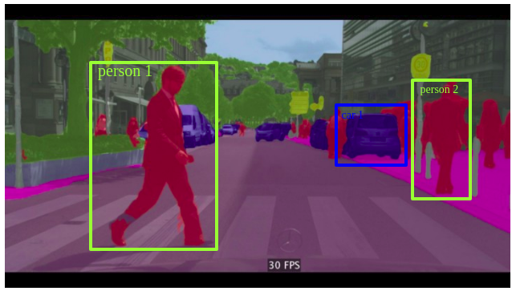
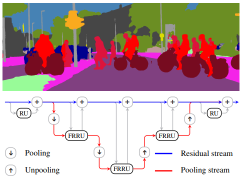
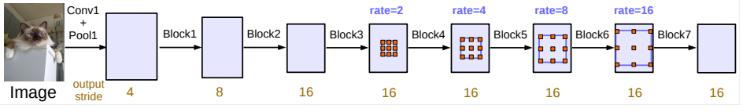

## Intro

Scott Mueller

###### smueller.tampa.ai@gmail.com

---
## Tampa.ai

Looking for Presenters

---
# State of the Art Image Segmentation with UNet

https://meanderingstream.github.io/segmentation_w_unet

---
* What is Segmentation?
* Where is Segmentation Used?
* What is UNet?
* Challenges with UNet
* Alternatives to UNet

---
## What is Segmentation?
---
## Classification

---
## Object Detection

---
## Semantic Segmentation

[1]

---
## Instance Segmentation

[1]

---
## Where is Segmentation Used?
---
## Street View

---
## Medical

[1]

---
## Another Medical

[5]

---
## Green Screen

[3]

---
## Body Segmentation

[3]

---
## Remote Sensing

[4]

---
## What is Unet?

[1]

---
## Training UNet

[CamVid with UNet Notebook](./nbs/lesson3-camvid.pdf)

---

## Challenges with Unit

* Memory Usage High

---

## Alternatives to Unet

---
## FRRN Full-Resolution Residual Networks

[6]

---
## PSPNet Pyramid Scene Parsing 

[6]

---
## FCDenseNet 100 Layers Tiramisu 

[6]

---
## DeepLabV3

[6]

---
Questions?
---
## Study Group

https://ai-tampa-study-group.github.io/meetings/

---
### Resources
[1] https://medium.com/@keremturgutlu/semantic-segmentation-u-net-part-1-d8d6f6005066

[2] https://mc.ai/diving-into-deep-convolutional-semantic-segmentation-networks-and-deeplab_v3/

[3] https://medium.com/tensorflow/introducing-bodypix-real-time-person-segmentation-in-the-browser-with-tensorflow-js-f1948126c2a0

[4] https://towardsdatascience.com/using-image-segmentation-to-identify-rooftops-in-low-resolution-satellite-images-c791975d91cc

---

### More Resources

[5] https://medium.com/health-data-science/classification-of-histopathology-images-with-deep-learning-a-practical-guide-2e3ffd6d59c5

[6] https://towardsdatascience.com/semantic-segmentation-with-deep-learning-a-guide-and-code-e52fc8958823

https://towardsdatascience.com/semantic-segmentation-of-aerial-images-using-deep-learning-90fdf4ad780

---

[KnowFalls.com](https://www.KnowFalls.com/)

Looking for Founder Fastai ML Practitioners

Elixir, Functional Programming, Rails, Experience

Web presentation skills